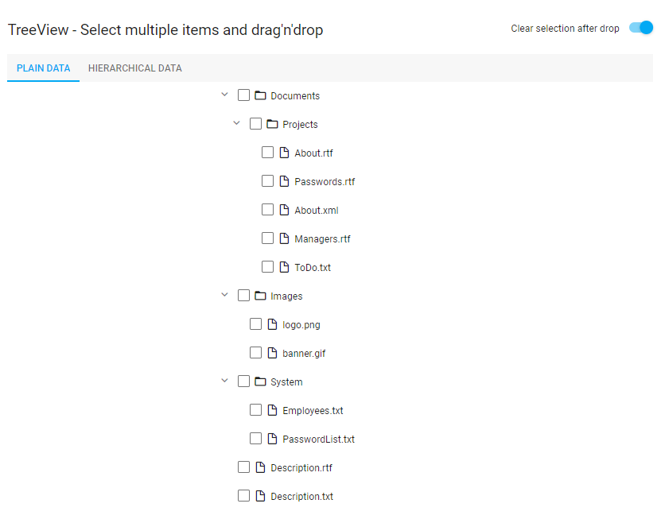

<!-- default badges list -->

<!-- default badges end -->
# TreeView for DevExtreme - How to drag and drop multiple items

This example demonstrates how to implement the Drag and Drop functionality for multiple selected items in [TreeView](https://js.devexpress.com/Documentation/Guide/UI_Components/TreeView/Getting_Started_with_TreeView/). It contains implementations for both plain and hierarchical data structures.

Use the following demos if you want to implement Drag and Drop of single items:

[TreeView - Drag & Drop for Plain Data Structure](https://js.devexpress.com/Demos/WidgetsGallery/Demo/TreeView/DragAndDropPlainDataStructure/jQuery/Light/)

[TreeView - Drag & Drop for Hierarchical Data Structure](https://js.devexpress.com/Demos/WidgetsGallery/Demo/TreeView/DragAndDropHierarchicalDataStructure/jQuery/Light/)

## Implementation Details
TreeView doesn't have a built-in Drag and Drop functionality. This example is based on the [DevExtreme Sortable](https://js.devexpress.com/Documentation/ApiReference/UI_Components/dxSortable/) component, which adds the capability of reordering items.

## Files to Review

- **Angular**
    - [app.component.html](Angular/src/app/app.component.html)
    - [app.component.ts](Angular/src/app/app.component.ts)
- **jQuery**
    - [index.js](jQuery/src/index.js)
- **React**
    - [App.js](React/src/App.js)
- **Vue**
    - [App.vue](Vue/src/App.vue)
- **ASP.Net Core**    
    - [Index.cshtml](ASP.NET%20Core/Views/Home/Index.cshtml)

## Documentation

- [Getting Started with TreeView](https://js.devexpress.com/Documentation/Guide/UI_Components/TreeView/Getting_Started_with_TreeView/)

- [TreeView - API Reference](https://js.devexpress.com/Documentation/ApiReference/UI_Components/dxTreeView/)
